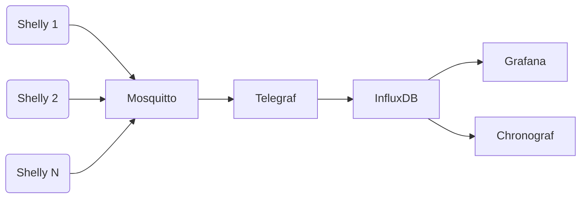

# shellySmartHome

## 

```mermaid
graph LR    
	Shelly1(Shelly 1) --> Mosquitto
	Shelly2(Shelly 2) --> Mosquitto
	ShellyN(Shelly N) --> Mosquitto
	Mosquitto --> Telegraf
	Telegraf --> InfluxDB
	InfluxDB --> Grafana
	InfluxDB --> Chronograf
```