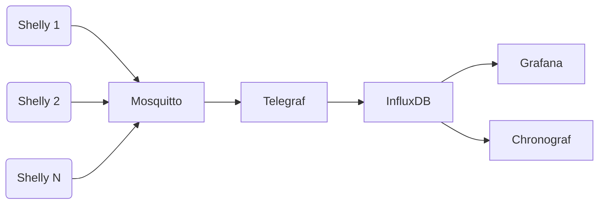

# Daves Shelly Smart Home Project

Welcome to the Daves Shelly Smart Home Project! This project integrates Shelly devices into a smart home system that is visualized through a Grafana dashboard and controlled via MQTT with Mosquitto and Telegraf. The automation enhances comfort, energy efficiency, and security within the home. This project is intended for private use and aims to simplify the setup process for individuals.

## Prerequisites

Ensure the following components are in place before starting the setup:

- Shelly devices as required (e.g., Shelly 1, Shelly Plug)
- Access to the local network
- Grafana, Mosquitto, and Telegraf installed and operational

## Installation and Configuration

### Mosquitto

Start with the configuration of Mosquitto. A sample configuration file can be found in the `config/mosquitto.conf` directory. Adjust this file as needed to suit your network environment.

docker exec -it mosquitto mosquitto_sub -h localhost -t '#' -u "shelly" -P "pw123456" -v
docker exec -it mosquitto mosquitto_sub -h localhost -p 1883 -t "#" -v

### InfluxDB

influx -database 'shelly_mqqt_db' -execute 'SELECT * FROM <measurement_name> LIMIT 10'

### Telegraf

Configure Telegraf to collect and forward data from your Shelly devices. An example Telegraf configuration can be found at `config/telegraf.conf`.

### Grafana

Download the provided Grafana dashboard JSON file and import it into your Grafana instance. This dashboard provides a visual overview of the status and activity of your Shelly devices.

## System Architecture

Here is a diagram illustrating the data flow within the Shelly Smart Home system:

This setup ensures that data from your Shelly devices is efficiently processed and displayed.

## Security Notes

The default password set for testing purposes is `pw123456`. It is crucial to change this password for production use. Choose a strong, unique password to ensure the security of your system.

## Usage

Once all components are installed and configured, you can monitor and control your Shelly Smart Home System via the Grafana dashboard.

## Contributing to the Project

Your contributions are welcome. If you have suggestions for improvements or need to correct errors, we look forward to your participation. Please submit your suggestions as issues or pull requests to the appropriate repository.

## License

This project is licensed under the MIT License, which allows you to use, modify, and distribute it freely.

## Contact

Do you have any questions or suggestions? Send me a pull request or open an issue in our project repository. 
I look forward to your contributions and good discussions!

Best of luck implementing and using your Shelly Smart Home Project!

---

For purchasing related hardware, you may consider checking this link: [Amazon](https://amzn.to/3TIPj7f).
